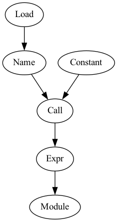

# How-Cpython-Works
This aims to help Python developers gain a deeper understanding of the inner workings of CPython, which can aid in writing more efficient and optimized Python code. This focuses solely on CPython and doesn't cover other Python implementations such as <a href="https://www.pypy.org/">PyPy</a>, <a href="https://www.jython.org/">Jython</a>, <a href="https://ironpython.net/">IronPython</a>, and so on.

## 0. Define an evaluand
We're going to define the function printing out "Hello, world!" and set it to an evaluand for the sake of simplicity.

## 1. Lexical Analysys
Lexical analysis is the first phase in the compiler designing which groups a stream of letters or sounds into sets of units that represent meaningful syntax.
```
python lexical_analysis.py
```
<details><summary>Output</summary>

```rb
[TokenInfo(type=62 (ENCODING), string='utf-8', start=(0, 0), end=(0, 0), line=''),
TokenInfo(type=1 (NAME), string='print', start=(1, 0), end=(1, 5), line='print("Hello, world!")'),
TokenInfo(type=54 (OP), string='(', start=(1, 5), end=(1, 6), line='print("Hello, world!")'),
TokenInfo(type=3 (STRING), string='"Hello, world!"', start=(1, 6), end=(1, 21), line='print("Hello, world!")'),
TokenInfo(type=54 (OP), string=')', start=(1, 21), end=(1, 22), line='print("Hello, world!")'),
TokenInfo(type=4 (NEWLINE), string='', start=(1, 22), end=(1, 23), line=''),
TokenInfo(type=0 (ENDMARKER), string='', start=(2, 0), end=(2, 0), line='')]
```
</details>
<br>

## 2. Syntax Analysis
Syntax analysis is the second phase in compiler designing in which the given input string is checked for the confirmation of rules and structure of the formal grammar.
```
python syntax_analysis_readable.py
```
<details><summary>Output</summary>

```rb
<class 'ast.Module'>
    <class 'ast.Expr'>: 1
        <class 'ast.Call'>: 1
            <class 'ast.Name'>: 1
                <class 'ast.Load'>
            <class 'ast.Constant'>: 1
```
</details>
<br>
If you want it to be visualized, you can try the following.

```
brew install graphviz
pip install graphviz
python syntax_analysis_visualizable.py
```
You'll see ast.png saved.



<br>

## 3. Bytecode
Bytecode is computer object code that an interpreter converts into binary machine code which is created based on the result of syntax analysis.
```
python bytecode.py
```
<details><summary>Output</summary>

```rb
              0 LOAD_GLOBAL              0 (print)
              2 LOAD_CONST               1 ('Hello, world!')
              4 CALL_FUNCTION            1
              6 POP_TOP
              8 LOAD_CONST               0 (None)
             10 RETURN_VALUE
```
</details>
<br>

## 4. Interpretation and execution by PVM
The bytecode is loaded into memory and executed by the Python Virtual Machine (PVM). During this process, the interpreter dynamically loads any required modules and resolves any dependencies between them. Once all the necessary modules have been loaded and linked, the interpreter creates an executable program that contains all the necessary bytecode.

When the program is executed, the PVM reads the compiled bytecode instructions from the executable program and executes them one by one in the order they were defined in the source code. The executable program serves as a container for the bytecode instructions and the necessary resources for the program to run, but it is not directly executed by the interpreter.

If you want to learn more about how Python's interpretation process works, you can take a look at <a href="https://github.com/python/cpython/blob/main/Python/ceval.c">ceval.c</a>. This file contains the C code that implements the Python interpreter's evaluation loop. During a Python function call, the interpreter calls the appropriate evaluation function to interpret that function's code, according to <a href="https://docs.python.org/ja/3.11/whatsnew/3.11.html#inlined-python-function-calls">the official documentation</a>.


## Your Python program runs fast?
The bytecode can provide some insight into the runtime behavior of a Python program. In this case, we compare two functions creating the list that contains multiples of 3 between 1 and 1000. 
```
def multiplier():
    list = []
    for i in range (1, 1000):
        if i%3 == 0:
            list.append (i)

def multiplierByListComprehension():
    list = [i for i in range (1, 1000) if i%3 == 0]
```

```
python comparison.py
```
<details><summary>Output</summary>

```rb
              0 BUILD_LIST               0
              2 STORE_FAST               0 (L)
              4 LOAD_GLOBAL              0 (range)
              6 LOAD_CONST               1 (1)
              8 LOAD_CONST               2 (1000)
             10 CALL_FUNCTION            2
             12 GET_ITER
             14 FOR_ITER                13 (to 42)
             16 STORE_FAST               1 (i)
             18 LOAD_FAST                1 (i)
             20 LOAD_CONST               3 (3)
             22 BINARY_MODULO
             24 LOAD_CONST               4 (0)
             26 COMPARE_OP               2 (==)
             28 POP_JUMP_IF_FALSE       20 (to 40)
             30 LOAD_FAST                0 (L)
             32 LOAD_METHOD              1 (append)
             34 LOAD_FAST                1 (i)
             36 CALL_METHOD              1
             38 POP_TOP
             40 JUMP_ABSOLUTE            7 (to 14)
             42 LOAD_CONST               0 (None)
             44 RETURN_VALUE

elapsed time: 0.000077248 [sec]

              0 LOAD_CONST               1 (<code object <listcomp> at 0x10b3294d0, file "/Users/iamstgt/How_CPython_Works/comparison.py", line 25>)
              2 LOAD_CONST               2 ('multiplierByListComprehension.<locals>.<listcomp>')
              4 MAKE_FUNCTION            0
              6 LOAD_GLOBAL              0 (range)
              8 LOAD_CONST               3 (1)
             10 LOAD_CONST               4 (1000)
             12 CALL_FUNCTION            2
             14 GET_ITER
             16 CALL_FUNCTION            1
             18 STORE_FAST               0 (L)
             20 LOAD_CONST               0 (None)
             22 RETURN_VALUE
Disassembly of <code object <listcomp> at 0x10b3294d0, file "/Users/iamstgt/How_CPython_Works/comparison.py", line 25>:
              0 BUILD_LIST               0
              2 LOAD_FAST                0 (.0)
              4 FOR_ITER                10 (to 26)
              6 STORE_FAST               1 (i)
              8 LOAD_FAST                1 (i)
             10 LOAD_CONST               0 (3)
             12 BINARY_MODULO
             14 LOAD_CONST               1 (0)
             16 COMPARE_OP               2 (==)
             18 POP_JUMP_IF_FALSE        2 (to 4)
             20 LOAD_FAST                1 (i)
             22 LIST_APPEND              2
             24 JUMP_ABSOLUTE            2 (to 4)
             26 RETURN_VALUE

elapsed time: 0.000056982 [sec]
```
</details>
<br>
As you can see, a list comprehension is faster than using an append method. Keep in mind that bytecode is just one piece of the puzzle, and there are many other factors that can affect a program's performance and behavior at runtime.
